# Wind Energy Forecasting Project Report Diagrams

## System Architecture Diagram

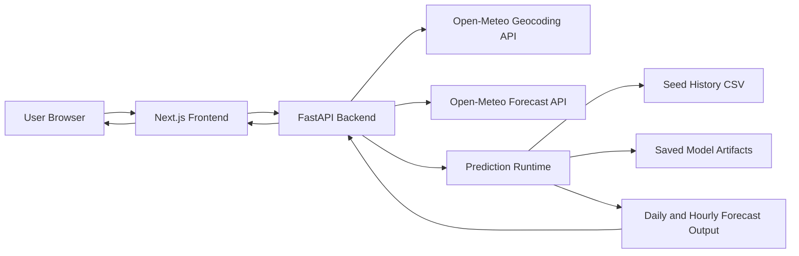

## Workflow Diagram

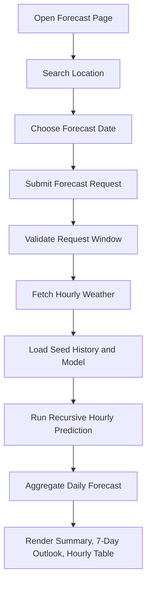

## DFD Level 0

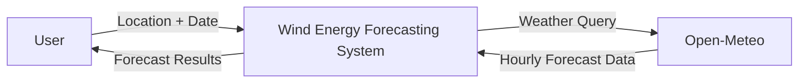

## DFD Level 1

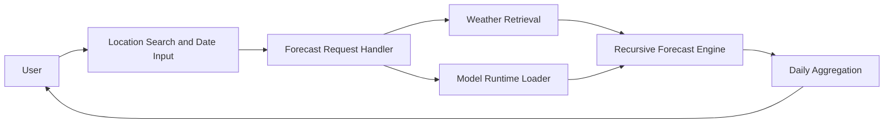

## DFD Level 2

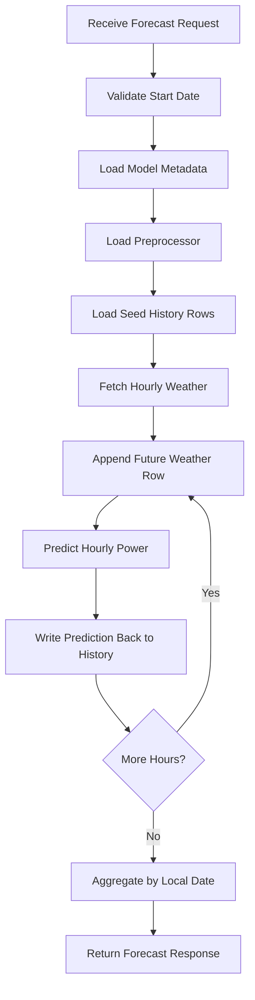

## Use Case Diagram

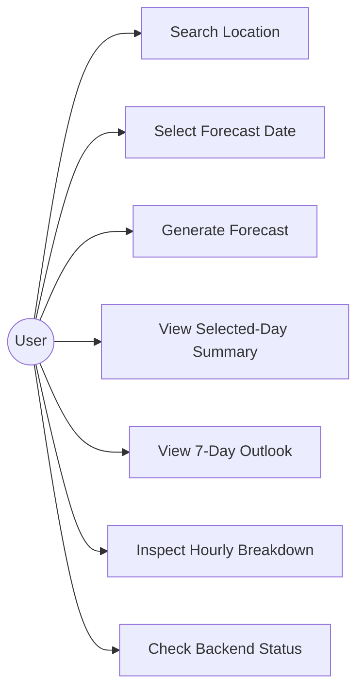

## Class Diagram

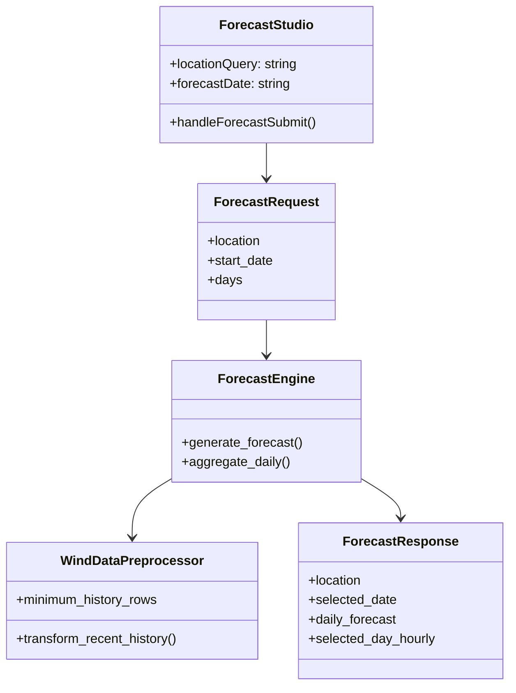

## Sequence Diagram

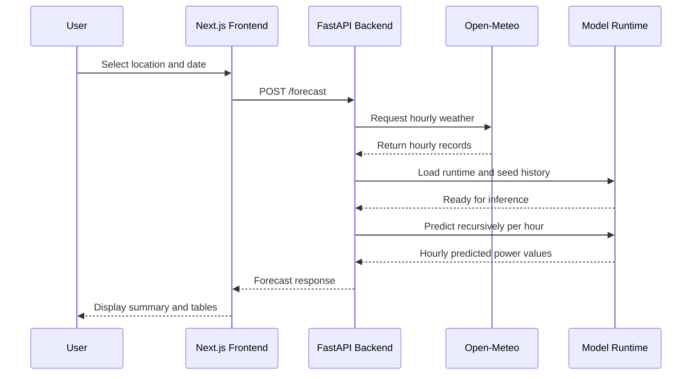

## Activity Diagram

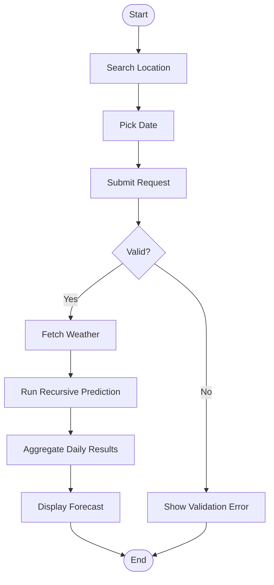

## Component Diagram

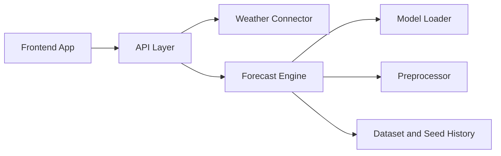

## Deployment Diagram

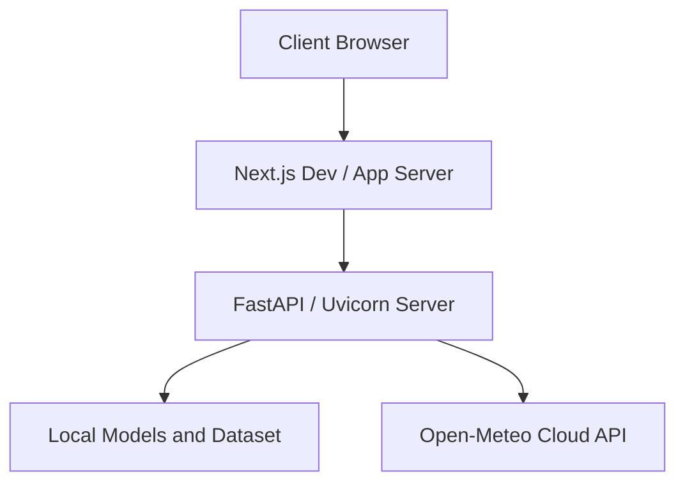

## ER Diagram

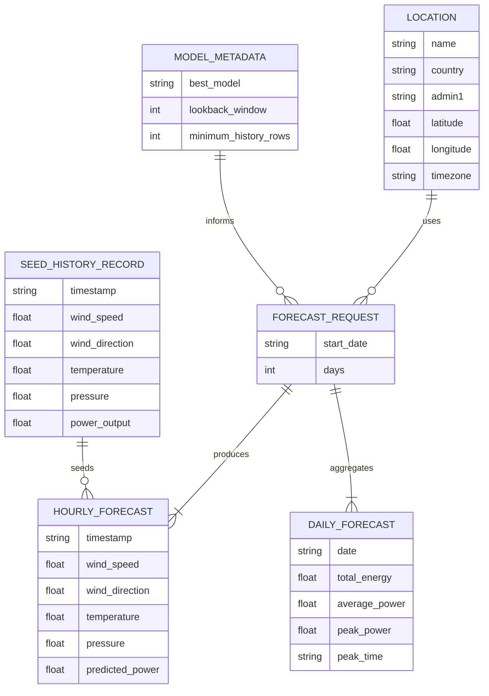

## Forecast Flowchart

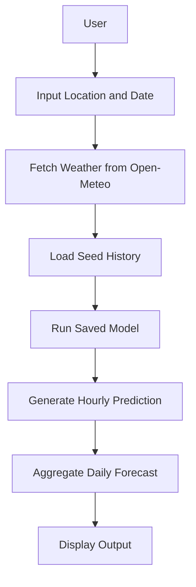
